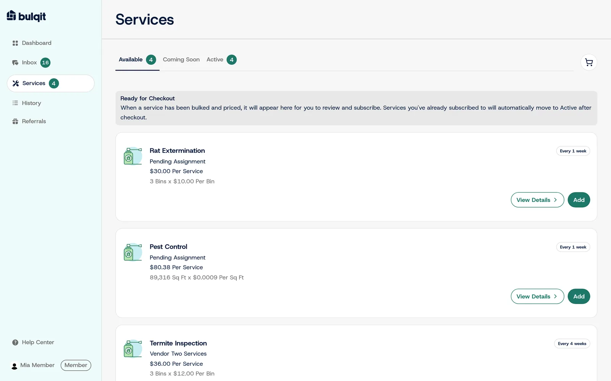

## The problem

Bulqit's first version was built by an external agency. When the agency was dismissed, the codebase came in-house with checkout, coupons, SMS number masking and email delivery all broken. About 130 user and QA reports were already open.

The company needed a working product for launch, and a redesign was waiting in Figma.

## What Joel did

Joel owned the front-end recovery. He personally resolved about 350 user and QA feedback reports, including the roughly 130 that were open before he joined.

He then led the pre-launch redesign. The lead designer had built a new system in Figma, and Joel built it in Next.js and React across the vendor app, the member app and the marketing site. That came to about 28 pull requests over 45 routes in five weeks, built to WCAG 2.1 and responsive requirements.

Along the way he closed more than 300 UI, UX and usability tickets across the vendor, member and admin apps.

*The member app after the redesign. Homeowners see the services priced for their block and add them to a cart.*

## Making the design system stick

A redesign drifts unless the code holds it in place. Joel moved the front end onto Figma design tokens across 619 files and added a lint rule that rejects hard-coded colors, so new code can't quietly reintroduce them.

After launch, he merged four competing type systems into the Figma text styles, a change that touched 728 files. He also upgraded the app to Tailwind CSS 4 with no visual regressions.

## Result

Of the 902 feedback reports filed during Joel's tenure, 898 were resolved before the company wound down. Bulqit soft-launched in July 2026 and launched publicly in August 2026 on the redesigned front end.
