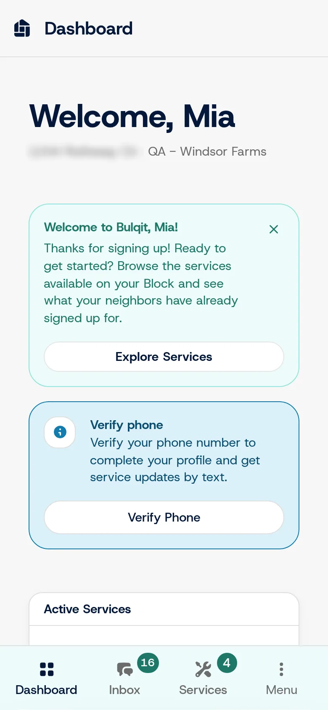

## The problem

Bulqit had an end-to-end suite in Cypress, and it checked nothing. With two in-house engineers and a launch coming, the team needed tests that would fail when the product broke.

## What Joel did

Joel replaced it with a Playwright suite built around the people who use Bulqit. The suite builds the app, seeds its own database and walks seven user roles from signup to card payment. That's 113 tests, and they run in CI on every pull request.

Because the suite seeds its own data, every run starts from the same known state, so a failure is worth looking at.

*A seeded member account, one of the seven roles the suite walks through. The address is blurred for privacy.*

## Guard tests

Some bugs are worth making impossible to bring back. Joel wrote 23 of the repository's 39 CI guard tests: small, targeted tests that fail the build if a specific fixed flaw returns.

## Launch QA

Automated tests covered the paths a script can walk. For the rest, Joel directed launch QA. He wrote persona-based test cases and checklist flows for every user role, then ran up to five external testers plus internal staff through each release.

## Result

Several releases came back with zero defect reports. Core web systems had zero downtime from launch to wind-down.
