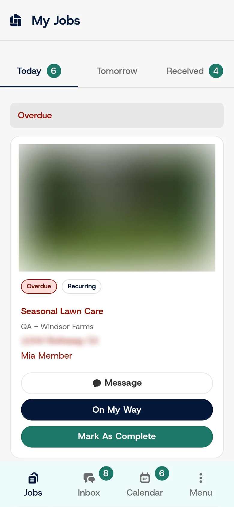
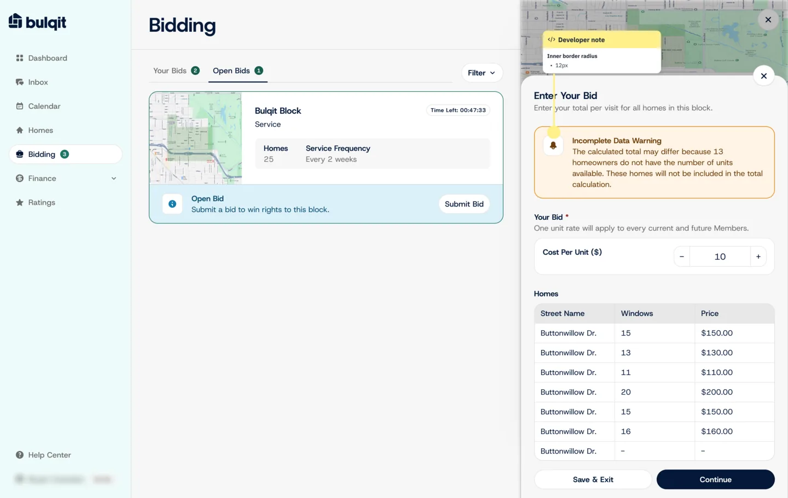
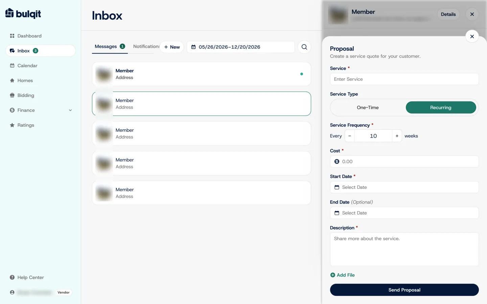
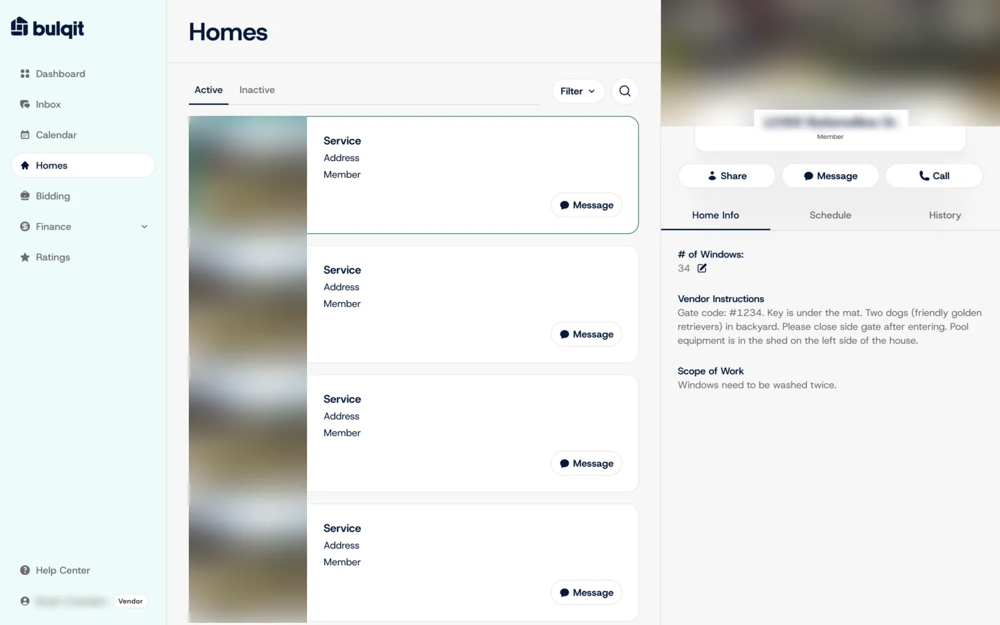
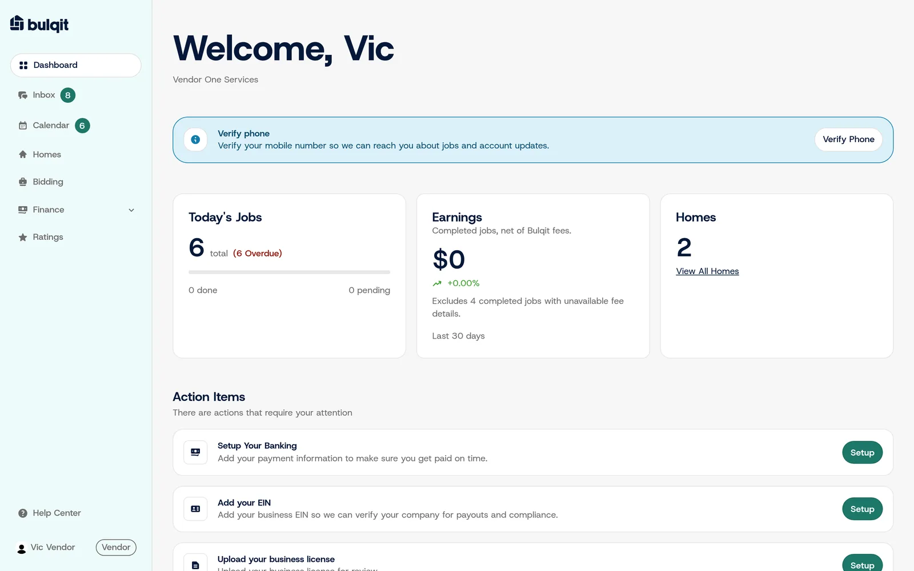

## The problem

A marketplace for recurring home services only works if vendors sign up, get approved and then run their day in the app. Each vendor had to submit insurance and compliance documents before approval, and every one who stalled meant a staff follow-up.

The vendor app also had to be good enough for daily use, by both the business owner and their field staff.

## What Joel did

Joel treated activation as a product design problem. He rebuilt the core vendor workflows: the scheduling calendar, field-staff jobs, bidding, the inbox and homes.

The calendar (above) groups each vendor's jobs into Upcoming, To Schedule and Completed, and flags overdue visits. Field staff get a phone-first jobs list with the actions they need on site.

*My Jobs for field staff. The house photo and address are blurred here for privacy.*

Bidding lets a vendor price a whole Bulqit Block at once: one unit rate applies to every current and future member in the block.

*Bidding, as designed in Figma. The local seed data had no open bids, so this is the design frame.*

*A recurring-service proposal in the inbox, from the lead designer's Figma file that Joel built in Next.js and React.*

*Homes, from the same Figma file: each home's vendor instructions and scope of work in one panel. House photos and the address are blurred.*

## Guided onboarding

New vendors start with a short guided flow that explains what Bulqit offers them, then land on a dashboard with action items: set up banking, add an EIN, upload a business license. Each item has its own Setup button, so the next step is always visible.

*Dashboard action items point each vendor to what's left to set up.*

## Result

About 75% of roughly 45 vendor signups submitted their insurance and compliance documents with no staff follow-up. That produced 31 approved vendors.
