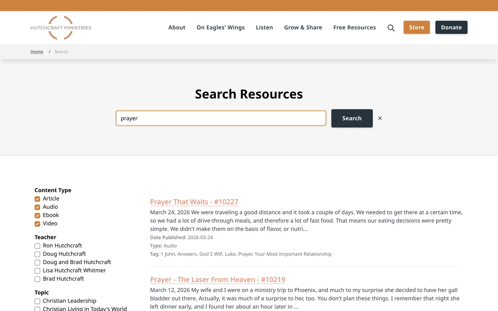
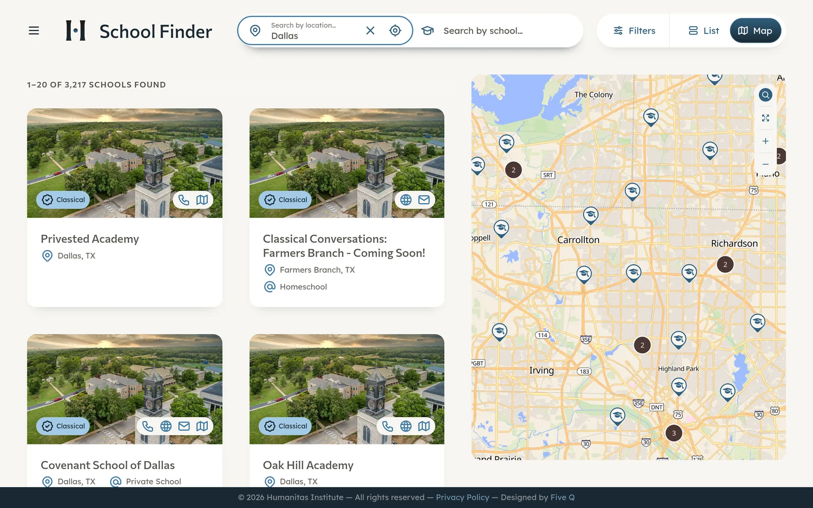
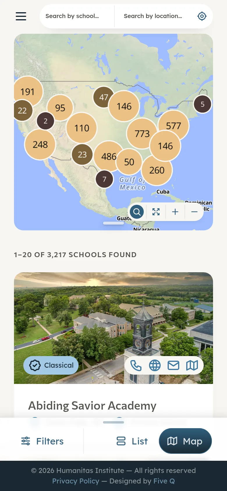

## The problem

Five Q builds and runs client websites on its own Kirby CMS platform. Several clients publish large archives of sermons, books, articles and audio, and visitors need to narrow those down by type, author, year and topic.

Building search separately for each site would mean solving the same problem again every time.

## What Joel did

Joel built a reusable Algolia InstantSearch plugin for the Kirby platform. Each site that uses it gets search results with filters (facets) that match its own content.

On **wiersbe.com**, the search page filters 806 records by Content Type, Author, Year, Topic and Series. The results above come from typing "joy".

*hutchcraft.com search, filtering 5,077 records.*

On **hutchcraft.com**, search covers 5,077 records. The homepage's "What's new?" topic tabs also pull from Algolia.

## The Humanitas school finder

Humanitas Institute needed a way for families to find schools. Its site runs on Astro and Payload, so the Kirby plugin didn't apply directly. Joel built a bespoke school finder on the same Algolia approach.

Visitors search by location or by school name, and see results as a list next to a MapLibre map. It covers 3,217 schools.

*The school finder, searching near Dallas.*

*On phones, the map clusters schools by region above the list.*

## Result

On all three sites, observed query round-trips from the browser ranged from 32 to 152 ms, all under 200 ms. Algolia's own processing time for a query is about 1 to 4 ms; most of the round-trip is the network.
