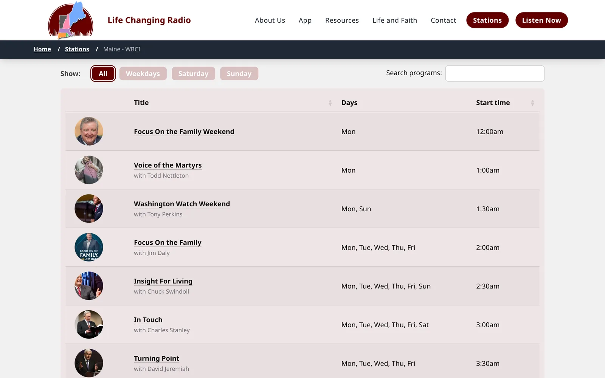
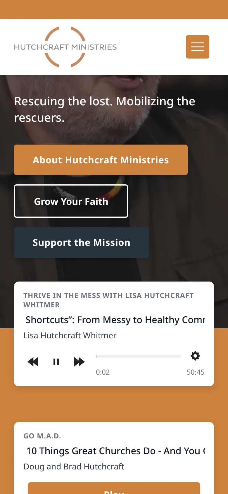

## The problem

Life Changing Radio is a regional broadcaster with six stations, all served from one website. Each station needs its own page where listeners can tune in and see what's on.

## What Joel did

Joel designed and built the live player and the integrated programme schedule.

Each station page has a **Listen Live** player on a Live365 stream. It shows the programme now playing, a LIVE timer, and what's next up, so listeners know what they're hearing and what follows.

Below the player sits the station's **programme schedule**: 123 entries with All, Weekdays, Saturday and Sunday filters, a program search and pagination.

*The schedule, filtered to All, with search.*

## A reusable player

Joel also wrote a reusable audio and video player plugin in PHP, Tailwind CSS and JavaScript, with Google Analytics tracking. It is used on other FiveQ client sites too, such as hutchcraft.com.

*The player plugin on hutchcraft.com.*

He also set up a CI pipeline with Cypress automated tests.

## Result

All six stations run from one site, each with its own live player and schedule.
